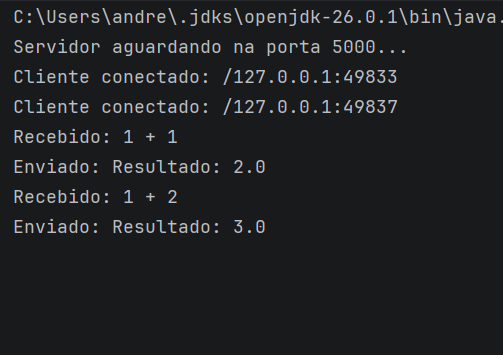
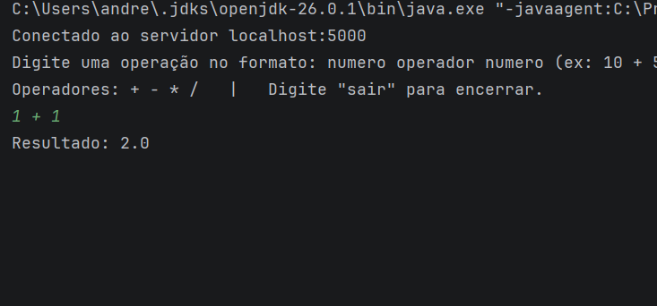

# Calculadora Remota com Sockets TCP em Java

Atividade prática da disciplina de Sistemas Distribuídos. A aplicação é composta por dois programas independentes, um servidor e um cliente, que se comunicam por sockets TCP. O cliente envia uma operação matemática em forma de texto, o servidor realiza o cálculo e devolve a resposta.

**Autor:** André Luís Cardoso Rezende Pimenta

## Estrutura do projeto

`Servidor.java` contém o servidor, que aguarda conexões na porta 5000, processa as operações recebidas e devolve as respostas.

`Cliente.java` contém o cliente, que se conecta ao servidor, lê as operações digitadas no teclado, envia ao servidor e exibe a resposta.

## Como compilar e executar

É necessário ter o JDK instalado (versão 14 ou superior, pois o código usa a sintaxe `->` do `switch`). Para conferir, rode `java -version`.

Compile os dois arquivos na pasta do projeto:

```
javac Servidor.java Cliente.java
```

Em um terminal, inicie o servidor:

```
java Servidor
```

Em outro terminal, inicie o cliente:

```
java Cliente
```

Sempre inicie o servidor antes do cliente. Se o cliente for aberto primeiro, ele exibirá a mensagem de que não foi possível conectar.

### Execução em duas máquinas

Por padrão o cliente se conecta a `localhost`, ou seja, à mesma máquina. Para rodar o servidor em um computador e o cliente em outro, as duas máquinas precisam estar na mesma rede. Descubra o IP da máquina do servidor (`ipconfig` no Windows ou `hostname -I` no Linux), altere a constante `HOST` em `Cliente.java` para esse IP e compile novamente. Se a conexão não for estabelecida, verifique se o firewall da máquina do servidor permite conexões de entrada na porta TCP 5000.

## Protocolo de comunicação

A comunicação usa texto puro, e **cada mensagem é uma única linha, terminada por quebra de linha**. É essa quebra de linha que indica onde cada mensagem termina, tanto nas requisições quanto nas respostas.

### Requisição (cliente para servidor)

O cliente envia uma linha no formato `numero operador numero`, com um espaço entre as três partes. Os operadores aceitos são `+` (soma), `-` (subtração), `*` (multiplicação) e `/` (divisão). Os números podem ser decimais, usando ponto como separador (por exemplo, `2.5`). Exemplos de requisições válidas: `10 + 5`, `7.5 * 2`, `100 / 8`.

A palavra `sair` não é enviada ao servidor: ela faz o cliente encerrar a sessão e fechar a conexão.

### Resposta (servidor para cliente)

O servidor responde com uma linha que sempre começa com um destes dois prefixos. Em caso de sucesso, `Resultado: valor`, por exemplo `Resultado: 15.0`. Em caso de falha, `Erro: motivo`, com um dos motivos a seguir.

| Situação | Resposta |
|---|---|
| Linha não possui exatamente 3 partes | `Erro: formato inválido` |
| Algum dos valores não é um número | `Erro: números inválidos` |
| Operador diferente de `+ - * /` | `Erro: operador inválido` |
| Divisão por zero | `Erro: divisão por zero` |

### Fluxo da comunicação

```
CLIENTE                                SERVIDOR
   |                                      |
   | -------- estabelece conexão -------> |
   | ----------- "10 + 5" --------------> |
   |                                      | processa
   | <------ "Resultado: 15.0" ---------- |
   | ----------- "10 / 0" --------------> |
   |                                      | processa
   | <--- "Erro: divisão por zero" ------ |
   | ------- "sair" (encerra) ----------> |
```

A conexão permanece aberta durante toda a sessão, permitindo várias requisições antes de o cliente encerrar.

### Exemplo de sessão

No cliente:

```
Conectado ao servidor localhost:5000
Digite uma operação no formato: numero operador numero (ex: 10 + 5)
Operadores: + - * /   |   Digite "sair" para encerrar.
10 + 5
Resultado: 15.0
10 / 0
Erro: divisão por zero
abc + 2
Erro: números inválidos
sair
Conexão encerrada.
```

No servidor:

```
Servidor aguardando na porta 5000...
Cliente conectado: /127.0.0.1:52314
Recebido: 10 + 5
Enviado: Resultado: 15.0
Recebido: 10 / 0
Enviado: Erro: divisão por zero
Recebido: abc + 2
Enviado: Erro: números inválidos
Cliente desconectado.
```

## Funcionamento interno

### Servidor

O servidor cria um `ServerSocket` na porta 5000 e entra em um laço que chama `accept()`, bloqueando até um cliente se conectar. A cada conexão, o `Socket` do cliente é entregue a uma nova `Thread`, de modo que vários clientes são atendidos ao mesmo tempo, cada um de forma independente. Em cada thread, o método `atender` lê as requisições linha a linha com `readLine()` até receber `null`, o que indica que o cliente encerrou a conexão. Para cada linha, o método `calcular` separa a operação com `split(" ")`, converte os números com `Double.parseDouble`, escolhe a operação com um `switch` e devolve o texto da resposta.

### Cliente

O cliente abre a conexão, lê cada operação do teclado, envia ao servidor com `println` e aguarda a resposta com `readLine()`. Se a resposta for `null`, significa que o servidor encerrou a conexão, e o cliente termina a sessão com uma mensagem.

### Tratamento de erros e encerramento de recursos

Os erros de comunicação são tratados com exceções. No servidor, `IOException` é capturada tanto no `main` (falha ao abrir a porta, por exemplo se já estiver em uso) quanto no atendimento de cada cliente, de forma que a falha de um cliente não derruba o servidor. Valores não numéricos geram `NumberFormatException`, tratada no método `calcular`. No cliente, `ConnectException` indica servidor desligado ou porta incorreta, e `IOException` cobre as demais falhas, como a queda da conexão no meio da sessão.

O `ServerSocket`, os sockets e todos os fluxos de entrada e saída são declarados em `try-with-resources`, que garante o fechamento automático ao final do bloco, mesmo quando ocorre uma exceção.

## Requisitos da atividade atendidos

Utilização de `ServerSocket` e `Socket`; programas separados de cliente e servidor; porta definida previamente (5000); envio de informações do cliente ao servidor; processamento no servidor; resposta ao cliente; mensagens no console sobre as principais etapas da comunicação; tratamento de erros por exceções; encerramento correto de fluxos e sockets. Também foram implementados os dois desafios adicionais: atendimento de múltiplos clientes simultâneos, com uma thread por conexão, e várias requisições na mesma conexão, com protocolo baseado em linhas.

## Captura de tela





